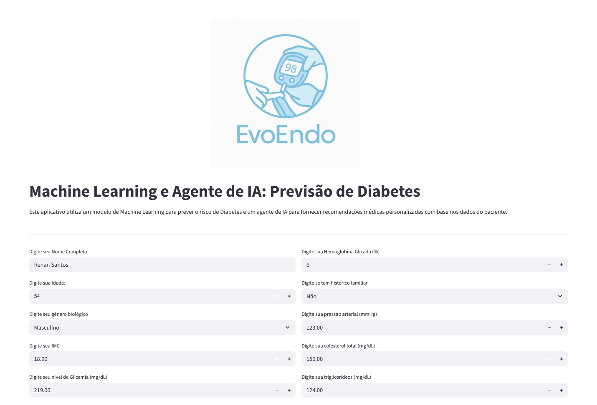
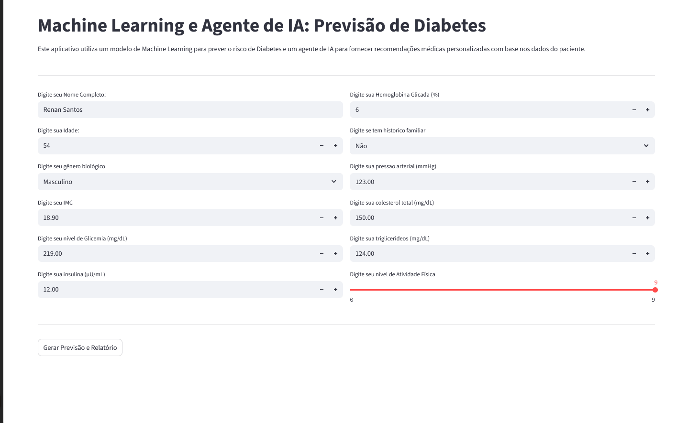
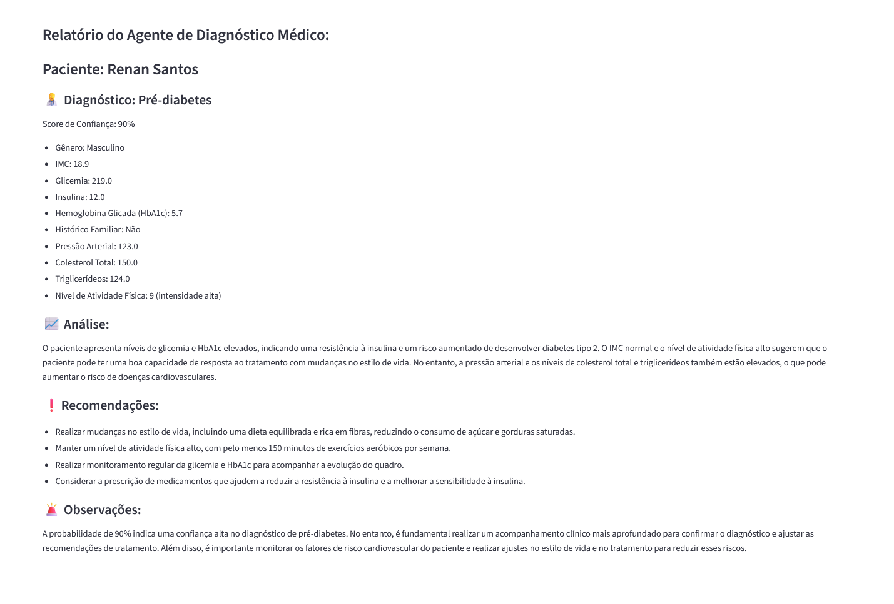

# 🩺 Diagnóstico de Diabetes com IA e Machine Learning

Este é um projeto experimental desenvolvido como parte do curso de extensão "Ciência de Dados e Inteligência Artificial Generativa", com o objetivo de demonstrar como ferramentas de Machine Learning e IA generativa podem ser utilizadas para auxiliar endocrinologistas no diagnóstico de Diabetes.

## 🧠 Sobre o Projeto

A aplicação combina um modelo preditivo de Machine Learning com um agente de IA generativa que analisa os dados clínicos do paciente e gera relatórios automatizados para auxiliar a tomada de decisão médica.

- O sistema recebe dados clínicos do paciente
- Realiza uma previsão do tipo de diabetes (ou ausência)
- E um agente de IA gera um relatório estruturado com base nos dados e na predição

**⚠️ Aviso importante:** Este projeto é educacional e experimental. As recomendações geradas não substituem a análise e o diagnóstico de um profissional de saúde certificado.

### 📌 Funcionalidades

- Interface interativa com Streamlit
- Previsão do tipo de diabetes com base em 11 parâmetros clínicos
- Relatório detalhado gerado por IA com recomendações objetivas
- Separação clara entre os papéis do modelo de ML e do agente generativo

## ⚙️ Tecnologias e Modelos Utilizados
### 📊 Machine Learning

- Algoritmo: Random Forest
- Acurácia no treinamento: 93%

### 🤖 IA Generativa

- Modelo de linguagem: llama3-70b-8192 (via Groq API)

### Imagens da Aplicação:

#### 1. Home:
</img>

#### 2. Dados Preenchidos:
</img>

#### 3. Relatório do Agente de IA:
</img>

### 💻 Como Executar o Projeto

1. Clone o repositório:

```bash 
git clone https://github.com/luccasena/Diabetes-Forecast.git
```

2. Crie o ambiente virtual:

```bash 
py -m venv venv
```

3. Ative o ambiente virtual:

```bash 
venv/Scripts/activate
```
4. Instale as dependências:

```bash 
pip install -r requirements.txt
```
5. Configure sua Chave de API, crie um arquivo '.env' e adicione:

```bash 
GROQ_API_KEY=sua chave de api
```

6. Execute a interface web:

```bash 
streamlit run streamlit_app.py
```


